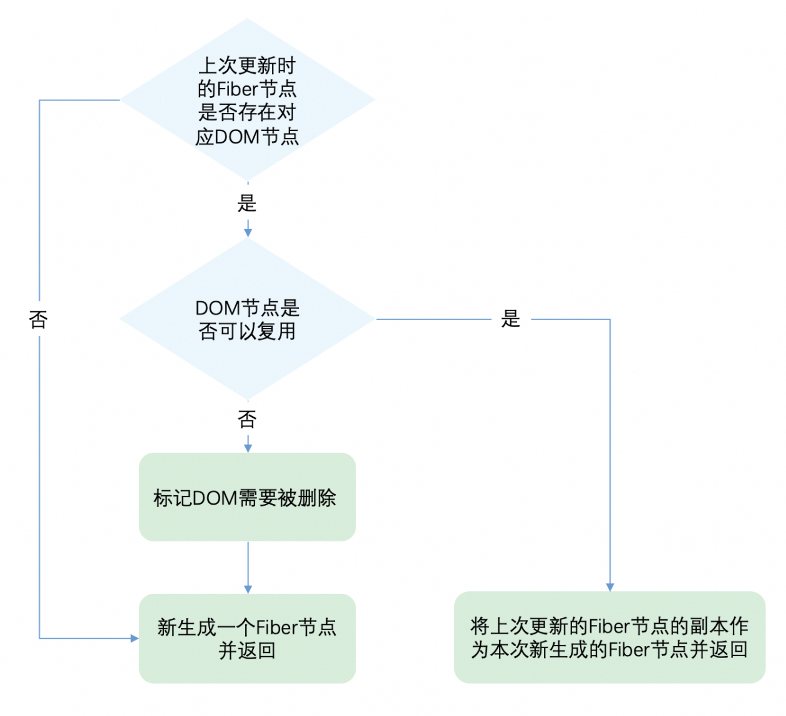

# CPU瓶颈
浏览器一般刷新频率为60hz，16.6ms刷新一次 （JS脚本执行 -----  样式布局 ----- 样式绘制）

GUI渲染线程与JS线程是互斥的

当JS执行时间过长时，没时间样式布局绘制样式，就会掉帧卡顿

react解决方法是在每一帧的时间中，预留一部分时间（一般5ms）用来执行js，如果这次没执行完，就下一帧继续执行，保证有足够的时间样式布局样式绘制，减少掉帧卡顿的可能。

所以，解决CPU瓶颈的关键是实现**时间切片**，而时间切片的关键是：将同步的更新变为可中断的异步更新。

# 老的React(15)架构
可以分为两层：

Reconciler（协调器）—— 负责找出变化的组件

Renderer（渲染器）—— 负责将变化的组件渲染到页面上

在React中可以通过this.setState、this.forceUpdate、ReactDOM.render等API触发更新。

每当有更新发生时，Reconciler会做如下工作：

JSX =》虚拟DOM
diff 虚拟DOM
通知Renderer将变化的虚拟DOM渲染到页面上

## React15架构的缺点
在Reconciler中，mount的组件会调用mountComponent，update的组件会调用updateComponent。这两个方法都会递归更新子组件。

## 递归更新的缺点
由于递归执行，所以更新一旦开始，中途就无法中断。当层级很深时，递归更新时间超过了16ms，用户交互就会卡顿。

# 新的React(16)架构
相较于React15，React16架构中新增了Scheduler（调度器）：

Scheduler（调度器）—— 调度任务的优先级，高优任务优先进入Reconciler

Reconciler（协调器） 更新工作从递归变成可中断的循环，每次循环都会调用shouldYield判断当前是否有剩余时间。

Renderer（渲染器）—— 负责将变化的组件渲染到页面上

整个Scheduler与Reconciler的工作都在内存中进行。协调器和渲染器不再交替进行，只有当所有组件都完成协调工作，才会统一交给渲染器

## 总结
React16采用新的Reconciler。

Reconciler内部采用了Fiber的架构。

# Fiber架构
Fiber，虚拟DOM在React中的正式称呼。中文翻译叫做纤程，与进程（Process）、线程（Thread）、协程（Coroutine）同为程序执行过程。

React Fiber可以理解为：React内部实现的一套状态更新机制。支持任务不同优先级，可中断与恢复，并且恢复后可以复用之前的中间状态。

其中每个任务更新单元为React Element对应的Fiber节点。

## 双缓存
在内存中构建并直接替换

在内存中绘制当前帧的动画，绘制好后直接用当前帧替换上一帧

## 双缓存Fiber树
React中最多存在两颗Fiber树，current Fiber树和 workInProgress Fiber树，两颗树的Fiber节点通过alternate属性连接。
```
currentFiber.alternate === workInProgressFiber;
workInProgressFiber.alternate === currentFiber;
```
React应用的根节点通过使current指针在不同Fiber树的rootFiber间切换来完成current Fiber树指向的切换。

即当workInProgress Fiber树构建完成交给Renderer渲染在页面上后，应用根节点的current指针指向workInProgress Fiber树，此时workInProgress Fiber树就变为current Fiber树。

每次状态更新都会产生新的workInProgress Fiber树，通过current与workInProgress的替换，完成DOM更新。

## mount时
创建fiberRootNode（整个应用的根结点） 和 rootFiber（App组件树的根结点）

此时，currentFiber树有rootFiber

然后构建在workInProgress树，此时两树只有rootFiber节点可复用（通过alternate属性相连）

构建完成后，在commit阶段渲染到页面fiberRootNode的current指向wordInProgress树的rootFiber使其变成current树

## update时
复用current Fiber树对应的节点数据构建一颗新的workInProgress树。
> 这个决定是否复用的过程就是Diff算法

workInProgress Fiber 树在render阶段完成构建后进入commit阶段渲染到页面上。渲染完毕后，workInProgress Fiber 树变为current Fiber 树。

# JSX 与 Fiber节点
JSX是一种描述当前组件内容的数据结构，他不包含组件schedule、reconcile、render所需的相关信息。

如：
+ 组件在更新中的优先级
+ 组件的state
+ 组件被打上的用于Renderer的标记

这些内容都包含在Fiber节点中。

在组件mount时，Reconciler根据JSX描述的组件内容生成组件对应的Fiber节点。

在update时，Reconciler将JSX与Fiber节点保存的数据对比，生成组件对应的Fiber节点，并根据对比结果为Fiber节点打上标记。

# Diff算法
一个DOM节点在某一时刻最多会有4个节点和他相关。

1. current Fiber。如果该DOM节点已在页面中，current Fiber代表该DOM节点对应的Fiber节点。

2. workInProgress Fiber。如果该DOM节点将在本次更新中渲染到页面中，workInProgress Fiber代表该DOM节点对应的Fiber节点。

3. DOM节点本身。

4. JSX对象。即ClassComponent的render方法的返回结果，或FunctionComponent的调用结果。JSX对象中包含描述DOM节点的信息。

Diff算法的本质是对比1和4，生成2。

为了降低算法复杂度，React的diff会预设三个限制：

1. 只对同级元素进行Diff。如果一个DOM节点在前后两次更新中跨越了层级，那么React不会尝试复用他。

2. 两个不同类型的元素会产生出不同的树。如果元素由div变为p，React会销毁div及其子孙节点，并新建p及其子孙节点。

3. 开发者可以通过 key prop来暗示哪些子元素在不同的渲染下能保持稳定。

## 单节点Diff：


第二步，判断DOM节点是否可以复用

