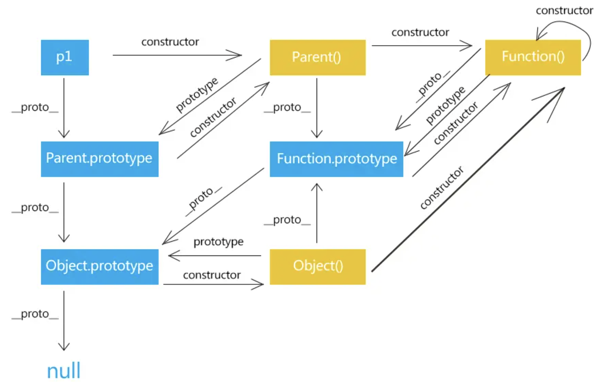

## 原型链  
```js
function Person(name = 'zzq') {
  this.name = name
}
const zzq = new Person()
zzq.__proto__ === Person.prototype // 指向实例原型
zzq.__proto__.constructor === Person // 实例原型的 constructor 指向原型的构造函数
zzq.__protp__.__proto__ === Object.prototype // 实例原型 继承自 Object的实例原型
```  
实例原型之间的继承链条就叫原型链  


